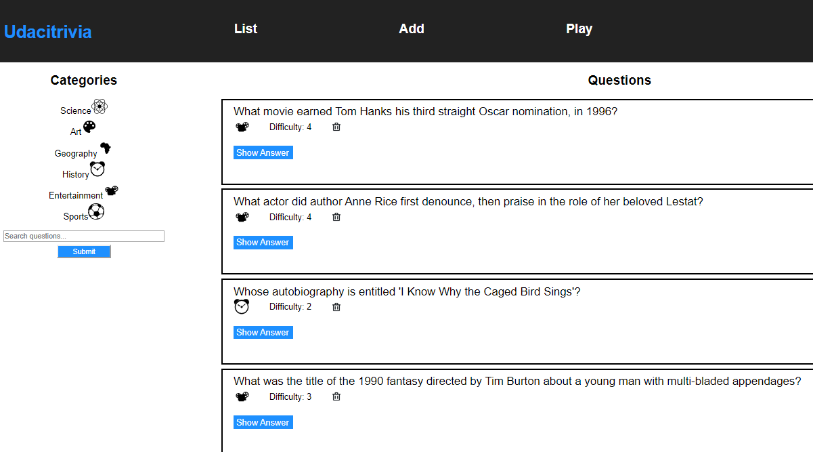

# Full Stack API Final Project

## Full Stack Trivia - my project for Udacity Full Stack Developer nanodegree program

Trivia game to create bonding experiences for any players. 

This website:
1) Displays questions - both all questions and by category. Questions should show the question, category and difficulty rating by default and can show/hide the answer. 
2) Deletes questions.
3) Adds questions and require that they include question and answer text.
4) Searches for questions based on a text query string.
5) Plays the quiz game, randomizing either all questions or within a specific category. 

## Parts

1. [`./frontend/`](./frontend/README.md)
2. [`./backend/`](./backend/README.md)

## About the Stack

### Backend

The `./backend` directory is completed using Flask and SQLAlchemy server. 

### Frontend

The `./frontend` directory contains a complete React frontend to consume the data from the Flask server. 
